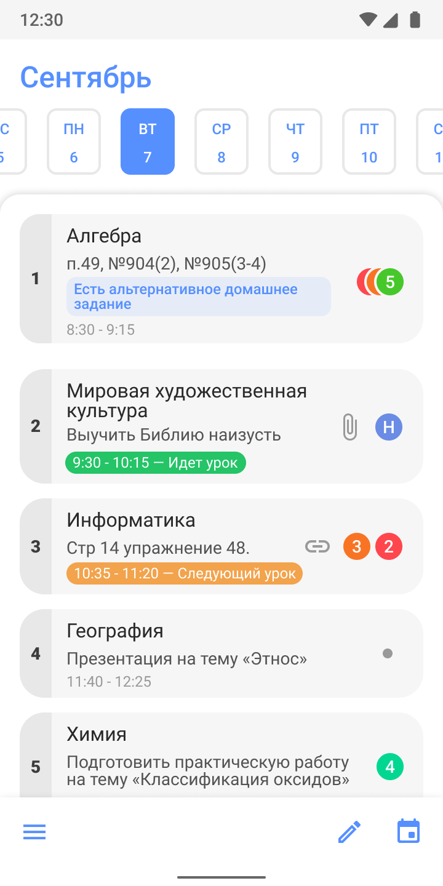
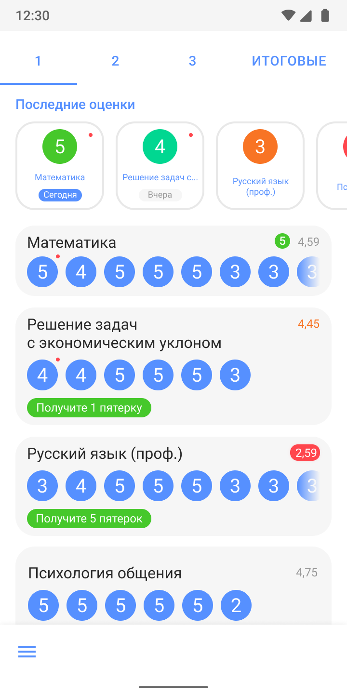
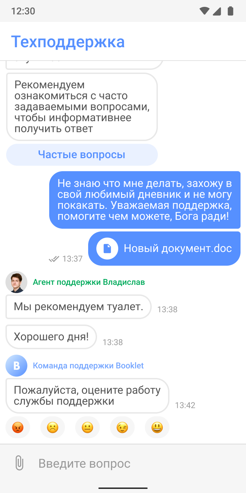

# Booklet
**Booklet** is diary aggregator for Russian schools.

Schedule | Marks |  Support
:-------:|:-----:|:------------:
  |   |  

Application supports Android 6 and above.

## Screens

Application contains following screens:

- [x] Schedule;
- [x] Marks;
- [ ] Gamefication;
- [ ] Statistics;
- [ ] Support;
- [ ] Menu screen;
- [ ] Paid Subscription;
- [ ] Advertising Subscription.

## Linked repositories

- [Backend](https://github.com/dormantman/booklet) — server-side of Booklet.

## Contact
Send me a message in Telegram: [@vakosta](https://t.me/vakosta).

Or in VK: [/vakosta](https://vk.com/vakosta).

Or E-mail: [v.akosta@ya.ru](mailto:v.akosta@ya.ru).
